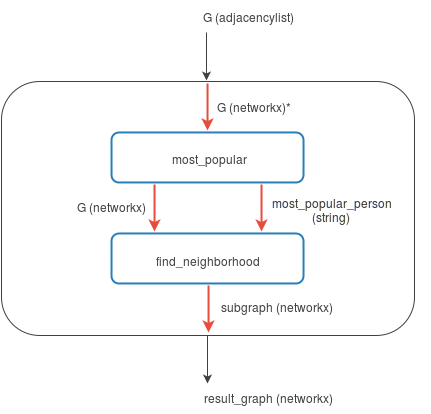

Facebook network analysis
-------------------------

This example demonstrates how to use the worker as a workflow system to load graph data,
perform analyses and transformations of the data using
`NetworkX <https://networkx.github.io/>`_, and then visualize the result
using `d3.js <http://d3js.org/>`_.

In this example we will:
 1. Obtain a set of Facebook data
 2. Find the most "popular" person in our data
 3. Find the subgraph of the most popular person's neighborhood
 4. Visualize this neighborhood using d3

.. testsetup::

   import os
   import girder_worker.tasks
   from girder_worker import PACKAGE_DIR, core
   core.utils.load_plugin('types', [os.path.join(PACKAGE_DIR, 'plugins')])

Obtain the dataset
~~~~~~~~~~~~~~~~~~~

The dataset is a small sample of Facebook links representing friendships, which can be obtained `here <_static/facebook-sample-data.txt>`__ [#f1]_.

The data we'll be using is in a format commonly used when dealing with graphs, referred to as an `adjacency list <https://en.wikipedia.org/wiki/Adjacency_list>`_.
The worker supports using adjacency lists with graphs out of the box.

.. note :: A full list of the supported types and formats is documented in :doc:`types-and-formats`.

Here is a sample of what the data looks like:

.. code-block:: none

       86      127
       303     325
       356     367
       373     404
       475     484

Each integer represents an anonymized Facebook user. Users belonging to the same line in the adjacency list indicates a symmetric relationship in our undirected graph.

Build a workflow
~~~~~~~~~~~~~~~~

Create a file named ``workflow.py``, this is the file we'll be using to create our workflow.

Find the most popular person
############################
One way of measuring who the most "popular" person in our graph is, is by taking the node with the largest
`degree <https://en.wikipedia.org/wiki/Degree_%28graph_theory%29>`_.

The script below finds the most popular person in the graph.

.. note :: This script assumes a variable ``G`` exists, that's because we define it as an input in the ``Task`` we define in the next step.

.. code-block:: python

   from networkx import degree

   degrees = degree(G)
   most_popular_person = max(degrees, key=degrees.get)

Defining our task, we can embed this script:

.. testcode::

   most_popular_task = {
       'inputs': [
           {'name': 'G',
            'type': 'graph',
            'format': 'networkx'}
       ],
       'outputs': [
           {'name': 'most_popular_person',
            'type': 'string',
            'format': 'text'},
           {'name': 'G',
            'type': 'graph',
            'format': 'networkx'}
       ],
       'script':
       """
   from networkx import degree

   degrees = degree(G)
   most_popular_person = max(degrees, key=degrees.get)
       """
   }

.. note :: As we saw with our last script assuming ``G`` would in be scope, this task explicitly states that both ``most_popular_person`` and ``G`` will be in scope (as its outputs) when it's done.

Find the neighborhood
#####################
Now that we have the most popular node in the graph, we can take the `subgraph <https://en.wikipedia.org/wiki/Glossary_of_graph_theory#Subgraphs>`_ including only this person and all of their neighbors. These are
sometimes referred to as `Ego Networks <http://www.analytictech.com/networks/egonet.htm>`_.

.. code-block:: python

   from networkx import ego_graph

   subgraph = ego_graph(G, most_popular_person)

Again, we can create a task using our new script, like so:

.. note :: Since these steps are going to be connected, our inputs are going to be the same as the last steps outputs.

.. testcode::

   find_neighborhood_task = {
       'inputs': [
           {'name': 'G',
            'type': 'graph',
            'format': 'networkx'},
           {'name': 'most_popular_person',
            'type': 'string',
            'format': 'text'}
       ],
       'outputs': [
           {'name': 'subgraph',
            'type': 'graph',
            'format': 'networkx'}
       ],
       'script':
       """
   from networkx import ego_graph

   subgraph = ego_graph(G, most_popular_person)
       """
    }

Put it together
###############
Conceptually, this is what our workflow will look like:

\* The format changes because of Girder Worker's auto-conversion functionality.

The entire rectangle is our workflow, and the blue rectangles are our tasks. Black arrows represent inputs and outputs and the red arrows represent connections which we’ll see shortly.

To make this happen, since we've written the tasks already, we just need to format this in a way the worker understands.

To start, let's create our workflow from a high level, starting with just its inputs and outputs (the black arrows):

.. testcode::

   workflow = {
       'mode': 'workflow',
       'inputs': [
           {'name': 'G',
            'type': 'graph',
            'format': 'adjacencylist'}
       ],
       'outputs': [
           {'name': 'result_graph',
            'type': 'graph',
            'format': 'networkx'}
       ]
   }

Now we need to add our tasks to the workflow, which is pretty straightforward since we've defined them in the previous steps.

.. testcode::

   workflow['steps'] = [{'name': 'most_popular',
                         'task': most_popular_task},
                        {'name': 'find_neighborhood',
                         'task': find_neighborhood_task}]

Finally, we need to add the red arrows within the workflow, telling the worker how the inputs and outputs are going to flow from each task.
These are called *connections* in Girder Worker parlance.

.. testcode::

   workflow['connections'] = [
       {'name': 'G',
        'input_step': 'most_popular',
        'input': 'G'},
       {'output_step': 'most_popular',
        'output': 'G',
        'input_step': 'find_neighborhood',
        'input': 'G'},
       {'output_step': 'most_popular',
        'output': 'most_popular_person',
        'input_step': 'find_neighborhood',
        'input': 'most_popular_person'},
       {'name': 'result_graph',
        'output': 'subgraph',
        'output_step': 'find_neighborhood'}
   ]

We now have a complete workflow! Let's run this, and write the final data to a file.

.. testcode::

   with open('docs/static/facebook-sample-data.txt') as infile:
       output = girder_worker.tasks.run(workflow,
                                  inputs={'G': {'format': 'adjacencylist',
                                                'data': infile.read()}},
                                  outputs={'result_graph': {'format': 'networkx.json'}})

   with open('data.json', 'wb') as outfile:
       outfile.write(output['result_graph']['data'])

.. testoutput::
   :hide:

   --- beginning: most_popular ---
   --- finished: most_popular ---
   --- beginning: find_neighborhood ---
   --- finished: find_neighborhood ---

.. testcode::
   :hide:

   import json

   with open('data.json') as infile:
       actual = json.load(infile)

   with open('docs/static/data.json') as infile:
       expected = json.load(infile)

   def dict_ordered(obj):
       if isinstance(obj, dict):
           return sorted((k, dict_ordered(v)) for k, v in obj.items())
       elif isinstance(obj, list):
           return sorted(dict_ordered(x) for x in obj)
       else:
           return obj

.. doctest::
   :hide:

   >>> dict_ordered(actual) == dict_ordered(expected)
   True

Running ``workflow.py`` will produce the JSON in a file called ``data.json``, which we'll pass to d3.js in the next step.

For completeness, here is the complete workflow specification as pure JSON:

.. literalinclude:: static/facebook-example-spec.json

This file can be loaded with Python's ``json`` package and directly sent to ``girder_worker.tasks.run()``:

.. testcode::

   import json

   with open('docs/static/facebook-example-spec.json') as spec:
       workflow = json.load(spec)

   with open('docs/static/facebook-sample-data.txt') as infile:
       output = girder_worker.tasks.run(workflow,
                                  inputs={'G': {'format': 'adjacencylist',
                                                'data': infile.read()}},
                                  outputs={'result_graph': {'format': 'networkx.json'}})

   with open('data.json', 'wb') as outfile:
       outfile.write(output['result_graph']['data'])

.. testoutput::
   :hide:

   --- beginning: most_popular ---
   --- finished: most_popular ---
   --- beginning: find_neighborhood ---
   --- finished: find_neighborhood ---

.. testcode::
   :hide:

   import json

   with open('data.json') as infile:
       actual = json.load(infile)

   with open('docs/static/data.json') as infile:
       expected = json.load(infile)

   def dict_ordered(obj):
       if isinstance(obj, dict):
           return sorted((k, dict_ordered(v)) for k, v in obj.items())
       elif isinstance(obj, list):
           return sorted(dict_ordered(x) for x in obj)
       else:
           return obj

.. doctest::
   :hide:

   >>> dict_ordered(actual) == dict_ordered(expected)
   True

.. note :: More information on Girder Worker tasks and workflows can be found in :doc:`api-docs`.

Visualize the results
~~~~~~~~~~~~~~~~~~~~~

Using JavaScript similar to `this d3.js example <http://bl.ocks.org/mbostock/4062045>`_ we're going to add the following to our ``index.html`` file:

.. literalinclude:: static/facebook-example.html

Which should leave us with a visualization similar to the following:

.. raw:: html

   

This is of course a more verbose than necessary workflow for the purposes of demonstration. This could have easily been done with one task,
however by following this you should have learned how to do the following with the Girder Worker:

 * Create tasks which consume and produce multiple inputs and outputs
 * Run tasks as part of a multi-step workflow
 * Use the worker's converter system to serialize it in a format JavaScript can read
 * Visualize the data using d3.js

.. testcleanup::

   import os
   os.remove('data.json')

.. [#f1] For attribution refer `here <http://socialnetworks.mpi-sws.org/data-wosn2009.html>`_.
